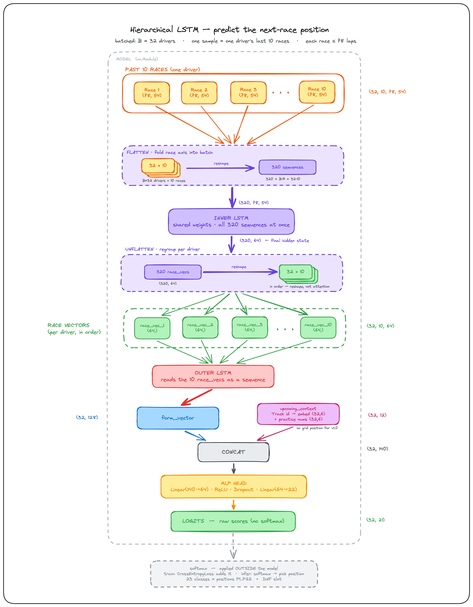

# F1 next-race position predictor

A personal project, built out of love for Formula 1, that predicts **where each
driver will finish in their upcoming race**.

For every driver it reads their **last 10 races, lap by lap** (pace, tyres,
telemetry, weather…) plus some context about the upcoming race (track, practice
results), and predicts a finishing position. Under the hood it's a hierarchical
model in PyTorch:

```
laps of one race      ─► inner LSTM ─► a "race summary" vector
the last 10 races     ─► outer LSTM ─► the driver's current "form"
form + upcoming info  ─► small MLP  ─► predicted finishing position
```

The full architecture, with the tensor shapes at each step:



This is a learning project trained on limited data — it is **by no means 100%
accurate**. Past results don't guarantee future ones: crashes, safety cars,
new drivers, and changing regulations can all throw the predictions off. Treat
it as "informed guesswork," not a betting tool.

> The older Keras model (in-race prediction from a few laps) still lives in
> `model.ipynb` / `best_f1_model1.keras`, but it's superseded by the PyTorch
> package below.

## Setup

Requires Python 3.13 and [uv](https://docs.astral.sh/uv/) (a fast Python package manager).

```bash
# 1. Install all dependencies into a local virtual environment
uv sync

# 2. Activate the environment
source .venv/bin/activate
```

That's it — you can now run any script or notebook in the project.

## Usage

### 1. Build the data

```bash
# Build the per-race CSVs under data/laps/ and data/results/
# (safe to interrupt; safe to re-run — it skips races already saved
#  and stops cleanly if it hits FastF1's 500-calls/hour limit)
python pipeline.py
```

Re-run `python pipeline.py` whenever a new race finishes — it only fetches
newly completed races.

**Heads-up for the first historical backfill:** FastF1's API allows 500 calls
per hour, and each race costs ~40 calls, so the pipeline hits the limit after
~12 races. Just wait ~1 hour and re-run; pulling every season since 2018 takes
several runs spread over a day.

### 2. Train the model

```bash
python -m f1ml.train
```

This trains the model, **stops early** when the validation score stops
improving, and saves the best weights to `f1_model.pt` (plus the fitted feature
scalers to `scalers.pkl`). Every run is logged to **MLflow** under the
`f1-position` experiment — settings, per-epoch loss curves, and the saved model.

Compare your runs in the dashboard:

```bash
mlflow ui      # then open http://localhost:5000
```

All the knobs (features, model sizes, learning rate, epochs, the train/val/test
years) live in one place: `f1ml/config.py`.

### 3. Check the baselines

```bash
python -m scripts.baselines
```

Prints what trivial strategies (random / always-DNF / always the most common
position) would score, so you can tell whether the model is actually learning
anything beyond the obvious.

### 4. Predict

```bash
python -m f1ml.predict                         # score the held-out test season(s) + show sample predictions
python -m f1ml.predict 2026 1                   # predict one specific race:  <year> <round number>
python -m f1ml.predict --run <run_id>           # use a past MLflow run's model instead of the local one
python -m f1ml.predict --run <run_id> 2026 1    # ...and predict one specific race with it
```

The single-race form prints each driver's top-3 predicted positions (with
confidence) next to the actual result, plus overall and top-10-finisher
accuracy.

> Note: the requested year must be listed in one of the split sets
> (`TRAIN_SET` / `VAL_SET` / `TEST_SET`) in `f1ml/config.py` — that's what tells
> the dataset to build prediction samples for it. The history it uses comes from
> earlier seasons automatically.

> `--run <run_id>` loads a model straight from a past MLflow run
> (`runs:/<run_id>/model`), rebuilding its own architecture — so it works even if
> you've since changed `config.py`. Grab a `run_id` from `mlflow ui`. Only works
> for runs trained with the current `train.py` (which logs the full model).

---

This repository will be updated depending on the free time I have.
